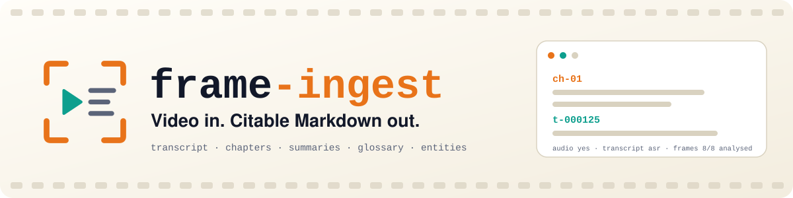
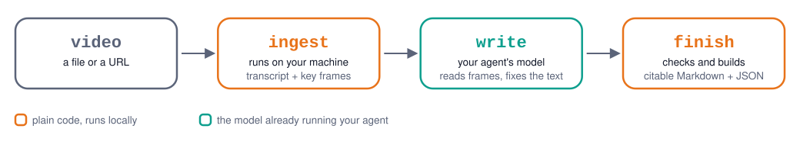

<div align="center">

<picture>
  <source media="(prefers-color-scheme: dark)" srcset="docs/assets/banner-dark.svg">
  
</picture>

<br>

**Turn any video, a local file or a URL, into a structured document you can cite.**


</div>

<br>

## Install

frame-ingest needs [uv](https://docs.astral.sh/uv/), a small tool that sets up Python and the CLI for you. Skip this step if you already have it (`uv --version`). Otherwise it takes about ten seconds:

```bash
brew install uv                                    # macOS
curl -LsSf https://astral.sh/uv/install.sh | sh    # Linux and macOS
```

Then install the skill:

```bash
npx skills add lavondev/frame-ingest
```

Then ask your agent to run it:

| Agent | Command |
|---|---|
| Claude Code | `/frame-ingest <video file or URL>` |
| Codex | `$frame-ingest <video file or URL>` |
| Gemini CLI, Cursor, Copilot, OpenCode, Cline | say *"frame-ingest this video"* |

<details>
<summary><b>Claude Code plugin</b></summary>

<br>

```text
/plugin marketplace add lavondev/frame-ingest
/plugin install frame-ingest@frame-ingest
```

</details>

<details>
<summary><b>Clone the repo</b> (Claude Code and Codex)</summary>

<br>

```bash
git clone https://github.com/lavondev/frame-ingest ~/.frame-ingest-src
~/.frame-ingest-src/scripts/install.sh
```

The repo ships the skill as `skills/frame-ingest/` and `.agents/skills/frame-ingest`. Codex and other `.agents/skills` readers can also copy `skills/frame-ingest` into `~/.agents/skills/`.

</details>

<details>
<summary><b>Command line only</b></summary>

<br>

```bash
uv tool install "frame-ingest[url,local] @ git+https://github.com/lavondev/frame-ingest"
frame-ingest doctor
```

</details>

<details>
<summary><b>Manual download</b></summary>

<br>

Download `frame-ingest-<version>.skill` from a release (a zip; verify it against `SHA256SUMS`) and unzip it into your agent's skills directory.

</details>

> [!NOTE]
> **Pre-alpha.** Feature complete and tested offline, not yet field-tested against real providers and harnesses.

## What you get

- A **corrected transcript**, with speech-to-text errors fixed using what was on screen
- **Chapters** with summaries, plus a **glossary** and an **entity index**
- **Stable anchors** (`ch-01`, `t-000125`) and timestamps, with a JSON sidecar, so every claim is citable

When it finishes, the agent gives you the document path, a TL;DR, the chapters and a coverage line:

```text
audio yes · transcript asr · frames 8/8 analysed
```

## How the data flows

<picture>
  <source media="(prefers-color-scheme: dark)" srcset="docs/assets/flow-dark.svg">
  
</picture>

Videos without captions are transcribed on your own machine, and nothing is uploaded for that. Frames and transcript go to whichever model runs your agent, and nothing goes to a cloud provider without your consent. If a video has audio but no transcript can be made, it stops and asks you instead of quietly dropping the sound.

## Learn more

- [Testing](docs/TESTING.md) · [Deep testing](docs/TESTING-DEEP.md) · [Threat model review](docs/THREAT-MODEL-REVIEW.md)
- [Security](SECURITY.md) · [Agent instructions](AGENTS.md)

<details>
<summary><b>Development</b></summary>

<br>

```bash
uv sync
uv run pytest && uv run ruff check . && uv run ruff format --check . && uv run mypy
```

Regenerate the artwork (logo, banner, flow diagram, both themes): `python3 scripts/gen_assets.py docs/assets`

</details>

## License

MIT, see [`LICENSE`](LICENSE).
